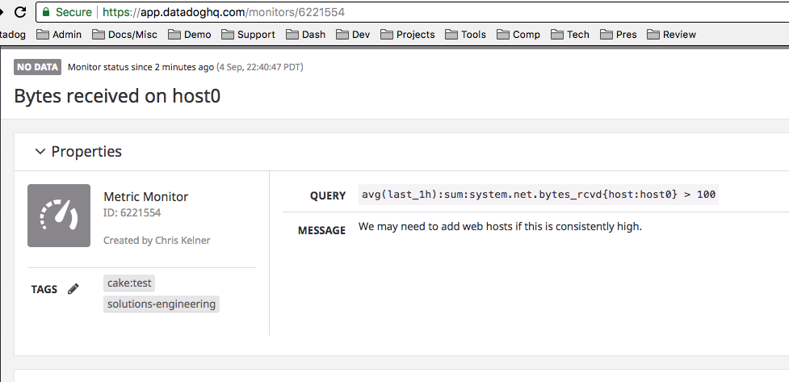

# Create Monitor
This script will create a `metric alert` monitor using `thresholds` as defined
in the
[Datadog API docs](https://docs.datadoghq.com/api/?lang=python#create-a-monitor)

# Run Code
- Setup a python virtualenv: `virtualenv create_monitor`
- Activate the virtualenv: `source create_monitor/bin/activate`
- Run `pip install -r requirements.txt`
- Run `python create_monitor.py -k <your-api-key> -a <your-app-key>`
  - Alternatively set `DATADOG_API_KEY` or `DD_API_KEY` and `DATADOG_APP_KEY` or
    `DD_APP_KEY` as environment variables (NOTE: It will need to be set WITHIN
    your virtualenv (e.g. after running step two here), see these docs for
    details:
    https://virtualenv.pypa.io/en/stable/reference/#environment-variables)
      - The `#kelnerhax` way is to cheat like so:
        `DATADOG_API_KEY=<secret> DATADOG_APP_KEY=<nuh-uh> python create_monitor.py`
- Result should be something like:
```
Creating a test monitor
{'multi': False, 'name': 'Bytes received on host0', 'tags': ['cake:test', 'solutions-engineering'], 'deleted': None, 'type': 'query alert', 'created_at': 1536126047000, 'created': '2018-09-05T05:40:47.314990+00:00', 'org_id': 11287, 'modified': '2018-09-05T05:40:47.314990+00:00', 'options': {'notify_audit': False, 'locked': False, 'silenced': {}, 'no_data_timeframe': 20, 'require_full_window': True, 'new_host_delay': 300, 'notify_no_data': True, 'evaluation_delay': 360, 'thresholds': {'critical': 100.0, 'warning': 80.0, 'critical_recovery': 70.0, 'warning_recovery': 50.0}}, 'overall_state_modified': None, 'overall_state': 'No Data', 'query': 'avg(last_1h):sum:system.net.bytes_rcvd{host:host0} > 100', 'message': 'We may need to add web hosts if this is consistently high.', 'creator': {'email': 'chris.kelner@datadoghq.com', 'handle': 'chris.kelner@datadoghq.com', 'id': 587333, 'name': 'Chris Kelner'}, 'id': 6221554}
```

